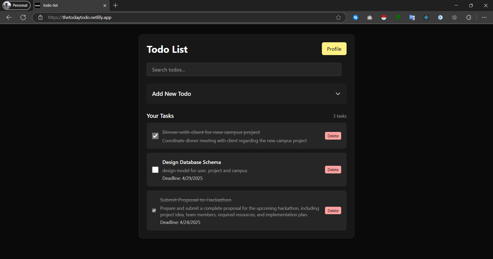

# todo-app

A simple Todo system built with **Next.js**, **PostgreSQL**, **Flutter**, and **Prisma**, hosted on **Netlify**. This project demonstrates core backend and frontend concepts using **Next.js API routes**, **JWT authentication**, and shared access for both web and mobile clients.



## Features

- Todo list management (Add, Update, Delete,Search)
- JWT-based authentication (no NextAuth)
- Flutter app access via API
- Uses Prisma ORM for PostgreSQL

## Local Development

```bash
# Clone the repo
git clone https://github.com/Adhishtanaka/todo-app.git

# Install dependencies
npm install

# Set up environment variables
cp  .env

# Prisma Setup
npx prisma migrate dev
npx prisma generate

# Run the development server
npm run dev
```

---

## Notes

- This is not production-hardened. It’s built for educational purposes.
- Rate limiting, CORS policies, and secure storage practices should be added for deployment.

---

## License

This extension is open source and available under the [MIT License](LICENSE).

## Contact

- **Author**: [Adhishtanaka](https://github.com/Adhishtanaka)
- **Email**: kulasoooriyaa@gmail.com

## Contributing

If you find any bugs or want to suggest improvements, feel free to open an issue or pull request on the [GitHub repository](https://github.com/Adhishtanaka/todo-app/pulls).


